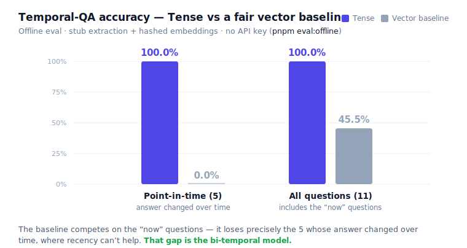

<!-- Generated by `pnpm eval:report` (eval/run-offline.ts --write). Do not edit by hand. -->
# Tense — offline eval results

Generated by `pnpm eval:offline` — **stub extraction + bag-of-words embeddings,
Postgres only, no API key, no network**. Deterministic: byte-identical on every
run. Regenerate with `pnpm eval:report`. The one LLM-judged cross-Predicate
scenario is excluded offline (it needs a model); `pnpm eval` covers it.

*Chart generated by the same `pnpm eval:report` run that wrote this file, so every
bar reconciles against the tables below.*

## Summary

| Metric (9 stub-extractable scenarios) | Tense | Fair vector baseline |
|---|---|---|
| **Temporal-QA — point-in-time (5 questions)** | **100.0%** | **0.0%** |
| Temporal-QA — all questions (11) | 100.0% | 45.5% |
| Supersession precision / recall | 100.0% / 100.0% | — |
| False-supersession rate | 0.0% | — |
| Extraction triple-F1 / valid_at accuracy | 100.0% / 100.0% | — |

Those supersession percentages are not round numbers on an unknown N. Across these
9 scenarios the gold set asserts Facts that *should* close and Facts that
*should stay Current* (the "still-true" cases that make false supersession
measurable at all):

- **Recall 100.0%** — 7 / 7 gold closures caught.
- **Precision 100.0%** — 7 / 7 closures correct.
- **False-supersession 0.0%** — 0 / 13 still-true Facts closed.

## What the gold set deliberately tests

A round 100% invites the obvious question — *is the eval rigged to pass?* So the
gold set is built to **break** Tense, not flatter it: every one of these
9 scenarios carries at least one adversarial property below, and
3 are "still-true" cases whose Facts must stay Current — exactly what a
memory that over-supersedes gets *wrong*. Tags are declared per scenario in
[`eval/gold.ts`](./gold.ts), so this matrix can't drift from what was run.

| Edge case | What a bug here would look like | Scenarios |
|---|---|---|
| **Answer changed over time** | the gold answer differs from the latest value, so a recency-sorted vector baseline is structurally wrong at a past `as_of` — the headline cases | 3 |
| **Supersession fires** | a single-valued Predicate gets a new value, so the prior Fact must close — never duplicate, never delete | 6 |
| **Must NOT supersede** | Facts that have to stay Current — these make false-supersession measurable; a memory that over-closes fails precisely here | 3 |
| **Out-of-order ingestion** | the older Fact arrives second and must be born already-closed, never supersede the newer one | 1 |
| **Tied valid_at** | two Facts share a valid_at, so only a transaction-time tiebreak can pick the winner | 1 |
| **Null valid_at** | a Source carries no date, so supersession must fall back to transaction time | 1 |
| **Multi-valued Predicate** | an accumulating relation (knows, contributed-to) where new values add and must never replace | 2 |

## The headline, question by question

The 5 point-in-time questions whose gold answer **changed over
time** — the one place a recency-sorted vector store is structurally wrong. Asked
at a past `as_of`, the baseline has no bi-temporal model, so it returns the
*most-recent* value and misses; Tense filters on valid time and returns who was
Current *then*.

| Scenario | Question | as_of | Gold | Tense | Baseline |
|---|---|---|---|---|---|
| reports-to org change (dated) | Who does Zach report to? | `2024-03-01` | Alice | Alice ✓ | Bob ✗ |
| lives-in move (dated) | Where does Mia live? | `2023-01-01` | Berlin | Berlin ✓ | Munich ✗ |
| out-of-order ingestion (older arrives second) | Who does Ron report to? | `2024-03-01` | Ada | Ada ✓ | Bea ✗ |
| three-step reports-to chain (dated) | Who does Eli report to? | `2021-06-01` | Pat | Pat ✓ | Remy ✗ |
| three-step reports-to chain (dated) | Who does Eli report to? | `2022-06-01` | Quinn | Quinn ✓ | Remy ✗ |

## Every question

Including the "now" questions, where the baseline is a fair competitor — it gets
most of them right, proof it is the strongest naive version, not a strawman. It
still misses one "now" question: the tied-`valid_at` tiebreak, where both Facts
share a `valid_at` so recency can't choose between them, and only Tense's
transaction-time tiebreak picks the later-ingested one.

| Scenario | Question | as_of | Gold | Tense | Baseline |
|---|---|---|---|---|---|
| reports-to org change (dated) | Who does Zach report to? | `now` | Bob | Bob ✓ | Bob ✓ |
| reports-to org change (dated) | Who does Zach report to? | `2024-03-01` | Alice | Alice ✓ | Bob ✗ |
| lives-in move (dated) | Where does Mia live? | `now` | Munich | Munich ✓ | Munich ✓ |
| lives-in move (dated) | Where does Mia live? | `2023-01-01` | Berlin | Berlin ✓ | Munich ✗ |
| null valid_at supersession (prose 'now') | Who does Sam report to? | `now` | Priya | Priya ✓ | Priya ✓ |
| out-of-order ingestion (older arrives second) | Who does Ron report to? | `now` | Bea | Bea ✓ | Bea ✓ |
| out-of-order ingestion (older arrives second) | Who does Ron report to? | `2024-03-01` | Ada | Ada ✓ | Bea ✗ |
| tied valid_at (transaction-time tiebreak) | Who does Tess report to? | `now` | Nina | Nina ✓ | Omar ✗ |
| three-step reports-to chain (dated) | Who does Eli report to? | `now` | Remy | Remy ✓ | Remy ✓ |
| three-step reports-to chain (dated) | Who does Eli report to? | `2021-06-01` | Pat | Pat ✓ | Remy ✗ |
| three-step reports-to chain (dated) | Who does Eli report to? | `2022-06-01` | Quinn | Quinn ✓ | Remy ✗ |
